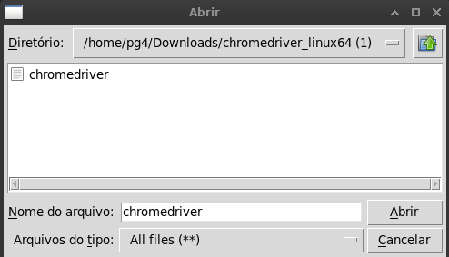
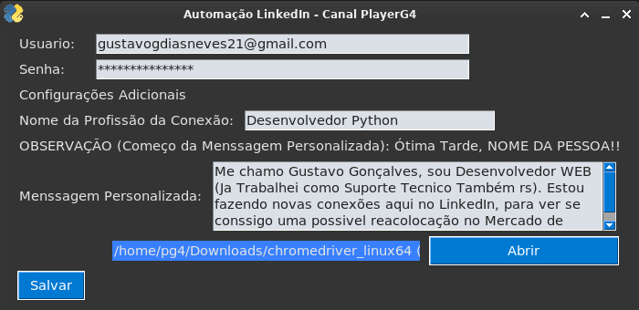
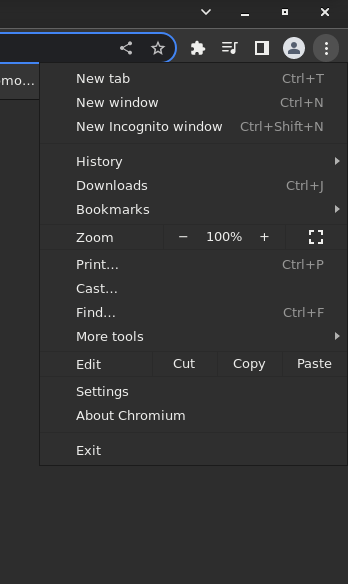
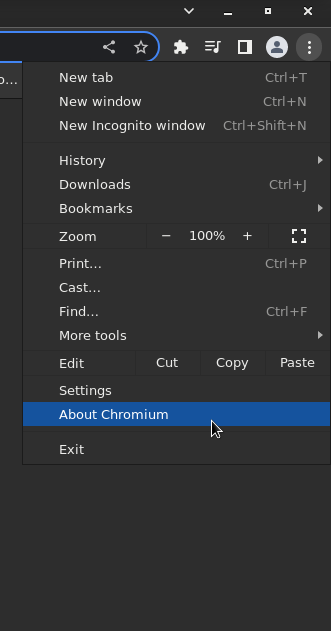
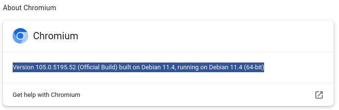

<!--
    TITLE:      README
    AUTOR:      GUSTAVO GONÇALVES DIAS NEVES
    DATA_INIT:  16.12.2022

    PROJECT:    BOT LINKEDIN - PYSIMPLEGUI
    
    CONNECT ME:
        Linkedin: https://www.linkedin.com/in/gustavo-gon%C3%A7alves-dias-neves-3b76b3252/
        github (curr-account): https://github.com/gustavogoncalvesdiasneves/
        
 -->

<h1 align="center" alt="LinkedIn BOT"><strong>LinkedIn BOT</strong></h1>

 

Esse Projeto tem o Objetivo de facilicitar a realização de Conexões no LinkedIn para pessoas que não tem muito tempo para ficar em Redes Sociais, com mensagens personalizadas.

 

**Link do Video Completo no meu Canal do Youtube (Player G4):** [Link do Video][link-video]

 

<h2>Índice</h2>

- **[Descrição](#descrição)** 
- **[Características](#características)** 
- **[Futuras Novidades](#futuras-novidades)** 
- **[Executar](#executar)** 
- **[Novidades](#novidades)** 
- **[Chrome Driver Download](#chrome-driver-download)** 

  

## **Descrição**
[BOT LinkedIn][link-bot-linkedin] é um aplicativo de automação para **conexões automaticas** , podendo ser **customizavel** e modificado caso o usuario desejar, com o difencial do começo da Mensagem vir com o Nome da Pessoa que vai fazer a conexão **(Ex: "Otimo Dia!! NomeDaPessoa, Menssagem...")**.
E Advinha o **Otimo Dia** / **Tarde** / **Noite** são automaticos conforme o Horario =D.

  

## **Características**
A aplicação fornece os seguintes recursos:
- Interface Grafica (PySimpleGUI)
- Buscador de Arquivos (Para **ChromeDriver**, para pessoas com versões diferentes do chrome)
- Biblioteca Time (Para menssagem de saudações automaticas conforme o horario)
- Executavel do Windows
- Executavel do Linux

## **Futuras Novidades**
- Biblioteca SQLite (Para guardar Presets, ajudando a não ficar digitando sempre que abre o programa, e **"Salvar Login"**)
- Interação com o Feed Automatico (Usando palavras Chaves **Ex: #certificados, se houver essa chave no feed vai comentar com a menssagem personalizada automaticamente**)
- Suporte ao Firefox

  

## **Executar**
Para Executar é bem simples somente baixar o [Executavel][link-executavel] e abrir.

**No Windows**

GIF

**No Linux**

Comando Usado:

 ~~~Bash
    sudo ./BOT_LinkedIn_Canal_PlayerG4
 ~~~

  

## **Novidades**

<h2>FileBrowse</h2>

<table border="0" cellpadding="1" cellspacing="1" style="width:500px">
	<tbody>
		<tr>
			<td></td>
			<td></td>
			<td></td>
		</tr>
	</tbody>
</table>

Adicionado com o proposito do usuario poder utilizar o **ChromeDriver** (Driver responsavel pelas automações com a Biblioteca **Selenium**)

<u><h4>Extremamente Importante para automações serem feitas SEM o Driver o Programa não roda...<h4 /><u/>

**Como Verificar a versão do Chrome para baixar o Driver comaptivel**

Nesse caso é bem simples, mas vai de cada navegador (Chromium, Chrome, Firefox, Iceweasel...)

Nesse caso acesse esse [PDF][link-pdf-navegador] (Achei bem direto e simples)

No meu caso como utilizo Chromium:

<table border="0" cellpadding="1" cellspacing="1" style="width:500px">
	<tbody>
		<tr>
			<td></td>
			<td></td>
			<td></td>
		</tr>
	</tbody>
</table>
	
No meu caso baixaria o *ChromeDriver* da *Versão (105.0.5195.52)*
	
## **Chrome Driver Download**	

[Link do Site Oficial do ChromeDriver][chrome-driver-link]

  

<!-- 
    LOCAL VARIABLES
 -->

[link-bot-linkedin]: https://github.com/gustavogoncalvesdiasneves/BOT_LinkedIn/
[link-executavel]: https://github.com/gustavogoncalvesdiasneves/BOT_LinkedIn/tree/main/build/Executavel
[link-video]: https://www.youtube.com/channel/UC_9SeJaG7zalUCosUt8BnFA
[link-pdf-navegador]: http://www.gestaoescolar.diaadia.pr.gov.br/arquivos/File/pde_roteiros/como_identificar_versao_navegador_pronto.pdf
[chrome-driver-link]: https://chromedriver.chromium.org/downloads
